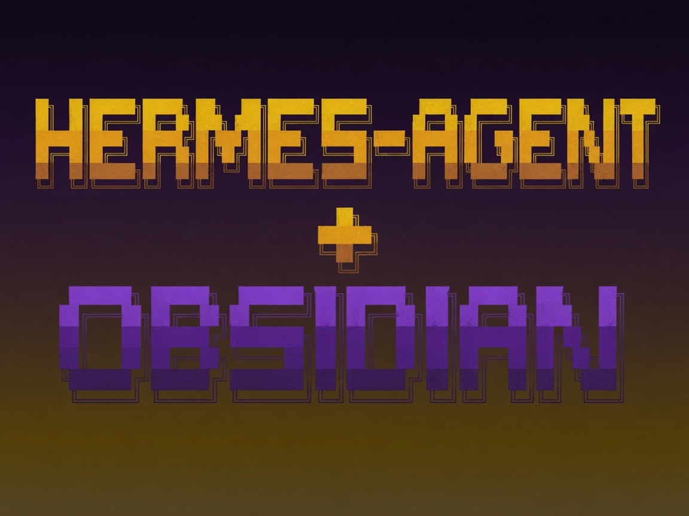

## Obsidian + Hermes: Your Self-Improving Second Brain

<p align="center">
  <a href="https://x.com/_0xpainn"></a>  
  <a href="https://github.com/Harlihm/Your-Self-Improving-AI-Brain/stargazers"></a>
  <a href="LICENSE"></a>
</p>




A practical system that turns Obsidian into a living knowledge base by connecting it to Hermes Agent. The result is a second brain that doesn’t just store information — it processes, connects, and acts on it automatically.

## The problem

Obsidian is excellent at storing knowledge but can’t do anything with it on its own.  
Most AI agents can execute tasks but lose all context between sessions.  

This setup bridges both worlds: permanent memory in Obsidian + reliable execution through Hermes, running on Grok via X Premium.

## What you get

- A clean, opinionated Obsidian vault structure designed for automation
- Hermes skills that read from and write back to your vault
- Automated daily briefs, inbox processing, project tracking, and weekly synthesis
- Fully local-first workflow using `Grok` (no Claude required)

## Vault structure
```
YourVault/
├── 00 - INBOX/                 # Drop everything here
├── 01 - NOTES/
│   ├── permanent/              # Atomic, evergreen notes
│   ├── daily/                  # Daily notes
│   └── meetings/
├── 02 - PROJECTS/              # Active work
├── 03 - RESOURCES/             # References & sources
├── 04 - HERMES-OUTPUTS/        # Everything Hermes generates
│   ├── briefings/
│   ├── analyses/
│   ├── reviews/
│   └── syntheses/
├── 05 - ARCHIVE/
└── 06 - SYSTEM/
    └── SYSTEM.md               # Master context file Hermes reads
```

## Core skills

- inbox-processor — Automatically organizes anything dropped in INBOX
- project-health — Weekly status reports on active projects
- connection-finder — Surfaces hidden links between notes
- weekly-synthesis — Generates weekly reviews and priority updates
- vault-morning-brief — Creates daily briefings (with optional image)

## Setup

0. Install Obsidian
Download and install Obsidian from the official site:  
`https://obsidian.md/`
It’s free and available for macOS, Windows, and Linux.

1. Install Hermes Agent
```bash
curl -fsSL https://raw.githubusercontent.com/NousResearch/hermes-agent/main/scripts/install.sh | bash
```
Hermes Agent repo: https://github.com/NousResearch/hermes-agent

2. Check installation
```bash
hermes --version
hermes doctor
```

3. Switch to Grok (X Premium)
```bash
hermes model
```
Select a Grok model (`grok-4.3` or similar) through the `xai-oauth `provider.


4. Give Hermes access to your vault
```bash
hermes mcp add filesystem --command 'npx -y @modelcontextprotocol/server-filesystem /full/path/to/your/vault'
hermes mcp configure filesystem
```

5. Create SYSTEM.md
Build your vault following the structure above, then create 
`06 - SYSTEM/SYSTEM.md` with your personal context, priorities, and rules.

6. Add the skills
Drop the skill files into  `~/.hermes/skills/.`

## How it actually works

1. `SYSTEM.md` loads as persistent context every time Hermes runs a skill
2. The Filesystem MCP gives Hermes read/write access to your entire vault
3. Skills follow a simple loop: Read → Reason → Write results back
4. Grok handles all reasoning through your X Premium connection

## Next steps

- Add automatic image generation for briefs
- Build a Research Converter skill
- Create an X posting workflow
- Add daily note templates

## Stack

- Obsidian — Knowledge storage
- Hermes Agent — Execution & automation
- Grok-4.3 (via X Premium) — Reasoning model
- Filesystem MCP — Vault access

## License

MIT
